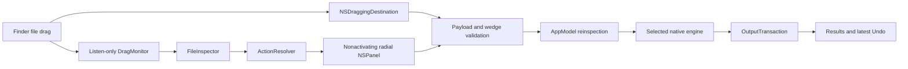

# Architecture

OrbitDrop has a portable core and a macOS application target. `Package.swift` builds and tests `OrbitCore`; `Scripts/generate-project.py` generates the Xcode application, static core library, native test target, and shared scheme from the source tree. Public AppKit windows host SwiftUI welcome, settings, and result views.

## Interaction and execution

`DragMonitor` uses a public, listen-only Core Graphics event tap on the main run loop. A candidate requires an observed mouse-down, a subsequent drag event, a newly written drag pasteboard, file URLs, and the configured modifier. The monitor never executes an operation. Its mouse-up cancellation waits 250 ms so it cannot remove the destination before AppKit delivers the drop.

`FileInspector` checks file resource information, a short signature, ImageIO support, and UTType. For supported still images it also summarizes the presence of standard GPS and selected EXIF/TIFF details without displaying values; uninspected formats are labeled accordingly. Inspection runs outside the main actor. Symbolic links and nonregular files are rejected; directories are permitted for ZIP creation. Cancelled or superseded inspection tasks cannot reopen an old wheel.

`ActionRegistry` defines the 23 concrete actions. `ActionResolver` filters them for homogeneous input types, selection count, supported source families, and common operations for mixed selections. Availability is a candidate capability; an engine checks actual codec, document, and size constraints before export.

`WheelController` presents a nonactivating `NSPanel` with native material and SwiftUI rendering. Eight category positions are stable; hovering a category reveals its concrete options in a second ring. `RadialGeometry` uses center-relative AppKit points, clockwise angles from north, annulus hit testing, and visible-frame clamping. The destination independently reads `NSDraggingInfo.draggingPasteboard`; `DropPayloadValidator` rejects mismatched, duplicate, missing, nonfile, or foreign-host payloads. Only a valid concrete wedge in `performDragOperation` calls the application.

`AppModel` reinspects the dropped URLs and confirms the action is still offered. It allows one operation at a time and routes the action to an `ActionEngine`. Progress updates return to the main actor; cancellation propagates to worker tasks, AVFoundation export, or the archive subprocess.

## Engines and persistence

| Component | Responsibility |
| --- | --- |
| `ImageEngine` | Still-image decoding, orientation, resizing, metadata changes, ImageIO output, and static libwebp encoding/decoding |
| `PDFEngine` | PDFKit merge/split; Core Graphics rendering and image-to-PDF; local Apple Vision OCR |
| `NativeMediaEngine` | AVFoundation preset selection, asynchronous export, track/duration/codec checks, cancellation |
| `ArchiveEngine` / `ZIPInspector` | Native `ditto` ZIP creation/extraction with strict structural validation, size limits, and monitored extraction |
| `FileEngine` | Streaming SHA-256, separate file copies, bounded JSON processing |
| `OutputTransaction` | Private staging, validation, disk-space checks, and exclusive rename to a new final path |

Output staging resides in a private `.orbitdrop-<UUID>` directory beside the destination, allowing publication with `renamex_np(RENAME_EXCL)` on the same volume. Engines validate before commit and attempt cleanup of their generated outputs if a batch fails. They do not replace input files or existing destination names.

Preferences use `UserDefaults`. Result URLs, byte counts, timestamps, and Undo metadata live in memory only. Optional recent history is capped at 20 entries; the getter filters entries older than 24 hours on every read, and insertion removes expired entries. No idle timer polls history. The interface displays the latest result. Undo records file identity, size, and modification time for that operation; it refuses directories and changed or unverifiable outputs.

There is no runtime network client, model download, telemetry pipeline, persistent document index, or adaptive action-ranking service. The build downloads the pinned libwebp source; the compiled application links it statically.
