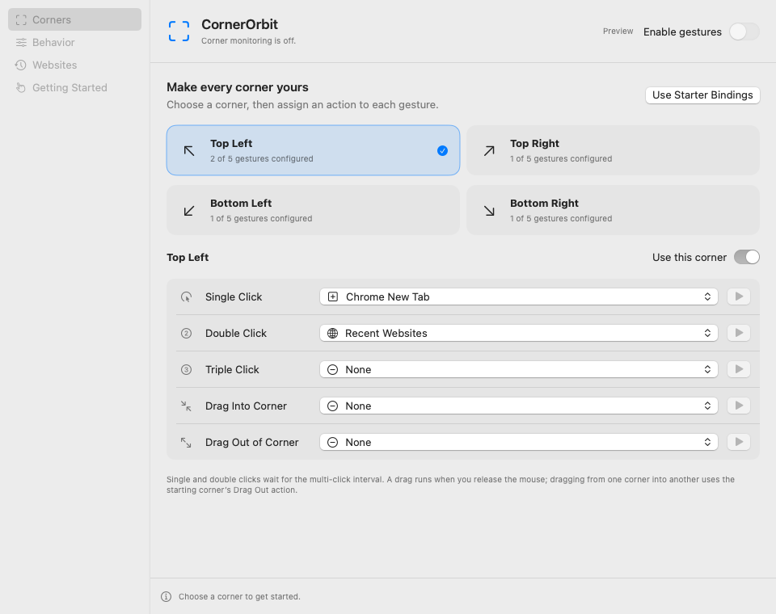

# CornerOrbit

A native menu bar app for **macOS 14 and later**, with a separate action for every gesture at every screen corner. The universal app supports Apple silicon and Intel Macs. This independent product lives entirely in `CornerOrbit/`; OrbitDrop, NotchOrbit and NotchOrbitPlus are unchanged.

**[Download CornerOrbit.app v0.1.0 (ZIP)](https://raw.githubusercontent.com/sknitd/orbit/b43e13edb99503527d37639a792f7fa01bca6ae2/CornerOrbit.app.zip)** · [SHA-256 checksum](https://raw.githubusercontent.com/sknitd/orbit/b43e13edb99503527d37639a792f7fa01bca6ae2/CornerOrbit.app.zip.sha256) · [Successful macOS build](https://github.com/sknitd/orbit/actions/runs/37239008254)

77 unique tests passed: 36 portable and 41 native. The download was built on a real macOS runner, verified for both CPU architectures, and independently checked against its checksum. It is ad hoc signed, **not notarized**.



The screenshot is an actual native fixture capture. Production starts with all actions unassigned; the starter preset is optional.

## Install and use

The downloadable ZIP contains `CornerOrbit.app`. Extract it, move the app to Applications, and open it. The build is ad hoc signed, not Developer ID signed or notarized. macOS may require **System Settings → Privacy & Security → Open Anyway** for this downloaded app.

1. Select one of the four corners and configure **Single Click, Double Click, Triple Click, Drag Into Corner and Drag Out of Corner** independently: **20 bindings** in total. All bindings and monitoring start off. **Use Starter Bindings** fills a sample configuration but leaves monitoring off.
2. Click **Enable gestures** when ready. If macOS asks, allow CornerOrbit in **Privacy & Security → Input Monitoring**, then enable it again. Restart the app if macOS requires it after changing access.
3. For a new Chrome tab or a blank Office/TextEdit document, first enable **Allow document and tab Automation** in Behavior. macOS can then ask for access to that specific app when you actually run the action. Installed target apps are required; missing apps and denied access produce visible errors.
4. Tune the active corner area, click interval, drag distance, cooldown, required modifiers and selected displays in Behavior. The menu bar icon opens Settings and pauses gestures.

Clicks wait for the configured multi-click interval so single and double clicks do not also fire during a triple click. A drag needs an actual mouse drag and sufficient movement, and fires on release. A drag from one corner to another uses the starting corner's Drag Out action, at most once. CornerOrbit observes mouse events without consuming them: the underlying app and any configured macOS Hot Corners can also respond. Disable conflicting Hot Corners or use modifiers if needed.

## Actions

| Action | Result |
| --- | --- |
| Chrome New Tab | Opens a new Chrome tab, creating a window if necessary. |
| Chrome History | Opens a searchable dropdown of explicitly loaded local Chrome history. |
| Recent Websites | Opens a searchable dropdown of links opened through CornerOrbit after local history is enabled. |
| New Word Document | Creates a separate blank, unsaved Word document. |
| New Excel Workbook | Creates a separate blank, unsaved Excel workbook. |
| New PowerPoint Presentation | Creates a separate blank, unsaved PowerPoint presentation. |
| New TextEdit Document | Creates a separate blank, unsaved TextEdit document. |
| WhatsApp Web | Opens `https://web.whatsapp.com/` in Chrome. |
| ChatGPT / Claude / Spotify | Opens the installed desktop app. |
| Activity Monitor / Finder | Opens the macOS app. |
| Custom Application | Opens the application selected by bundle identifier or an app picker. |
| Custom Website | Opens a validated HTTP(S) URL in Chrome. |
| Downloads / Applications / System Settings | Opens the matching macOS folder or app. |
| None | Leaves that gesture unassigned. |

Chrome and document creation use fixed AppleScripts with a timeout; user strings are never executable script or shell input. Website opens use NSWorkspace and do not need Apple Events. No action runs merely because you select or save a binding. The adjacent Run button is an explicit way to test one action.

## Chrome history and recent websites

In **Websites**, choose a Chrome profile folder or its `History` file. A typical profile is `~/Library/Application Support/Google/Chrome/Default`; other profiles have separate history. Connecting starts a read; subsequent refreshes are explicit. Opening the corner dropdown never refreshes or scans automatically. Arrow keys select a result and Return opens it in Chrome. The dropdown is attached to CornerOrbit's menu bar icon.

SQLite opens the chosen database read-only, with a bounded query and timeout. Live WAL databases are supported using SQLite's normal coordination, which may create or update the transient `-shm` index/lock sidecar. CornerOrbit does not edit database records, checkpoint, delete or copy browser history. Access failures remain visible; previous successfully loaded entries and their timestamp are retained on refresh failure. File access is controlled by macOS; the app never grants itself Full Disk Access.

Up to 100 Chrome entries are held in memory until disconnect or quit. The app stores only its chosen connection bookmark, not a duplicate Chrome history database. **Remember websites opened through CornerOrbit** is a separate opt-in: it keeps at most 200 validated links locally, records only successful explicit opens, and does not observe browsing. Turning it off clears its saved links. There is no account, telemetry, sync, network fetch, cloud AI or arbitrary shell action.

## Settings and compatibility

The bundle identifier is `com.sknitd.CornerOrbit`. Configuration is stored in `~/Library/Application Support/com.sknitd.CornerOrbit/settings.json`; history connection and recent-link preferences use this app's UserDefaults domain. Malformed configuration is preserved for explicit recovery. Settings writes are validated and atomic. No settings or files belonging to the other Orbit apps are read or changed.

When a previously enabled installation starts, it resumes only if Input Monitoring is already granted; startup never requests access. Disabled monitoring has no event tap or sampling timer. Click timers are one-shot. Changing settings, pausing gestures, display changes and session transitions cancel pending gesture recognition. Static corner hints are optional and off by default. Public screen UUIDs identify selected displays where available; a labeled session-only fallback cannot promise stable identity across reconnects.

## Build and validation

```sh
# From the repository root; portable Swift 6 tests also run on Linux:
bash CornerOrbit/Scripts/cloud-core-tests.sh

# On a Mac with Xcode 16+ and the command-line tools:
cd CornerOrbit
python3 Scripts/generate-project.py --check
bash Scripts/build.sh
```

The Mac script runs portable and hosted native tests, captures actual native fixture views, builds both CPU slices with a macOS 14 minimum, verifies an ad hoc signature, measures idle launch CPU/RSS, and produces `dist/CornerOrbit.app.zip` plus its SHA-256 checksum. See [EVALUATION.md](EVALUATION.md) for executed evidence and [known-limitations.md](known-limitations.md) for physical Mac checks.

The delivered ZIP is 1,239,876 bytes. Its SHA-256 is `881613151aa1c1e366610d1c9fa78ac53cb22e7b5628cf8f4c8951c72574c390`.

The workflow is stored inside this subdirectory at [`.github/workflows/build.yml`](.github/workflows/build.yml). CI uses an isolated `codex/cornerorbit-build` subtree branch, where this directory becomes the repository root. That allows native CI without editing the existing repository workflows. Each run preserves its exact source identifier, logs, previews and successful package on a separate result branch.
