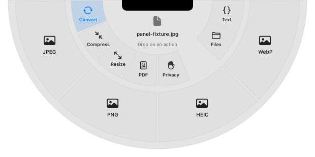

# NotchOrbit

NotchOrbit is a native macOS menu bar utility that opens file actions in a semicircle below your MacBook's notch. **Drag files toward the notch; no modifier key is required.** Hover a category, move into a concrete action, and release to create an output while retaining the original.

This app lives in its own `NotchOrbit/` subdirectory, with its own Xcode project, application identifier, preferences, and build output. It shares OrbitDrop's local transformation engines and action catalog. On a display without a camera notch, the activation target is the top center of that display.

## Compatibility and installation

The app targets **macOS 14 or later**, on Apple Silicon and Intel. Building from source requires Xcode 16 or later, CMake, Python 3, and Git. The packaged app does not require developer tools.

[**Download NotchOrbit.app.zip**](https://github.com/sknitd/orbit/raw/22d4fddbf7dda0beb49e88219c3087a5f6a63f83/NotchOrbit.app.zip) · [SHA-256 checksum](https://github.com/sknitd/orbit/blob/22d4fddbf7dda0beb49e88219c3087a5f6a63f83/NotchOrbit.app.zip.sha256)

This is version **0.1.0**, built from source commit `18bc8fac7c55bacd87e3e987fe0280530558925d` by [macOS CI run 37037710220](https://github.com/sknitd/orbit/actions/runs/37037710220). All **71 tests passed**: 37 shared core, 27 notch geometry/activation, and 7 hosted native tests. The universal Release build, signature verification, and three-second startup check also passed. If the repository is private, sign in to GitHub with an account that has access before downloading.

The ZIP is approximately 3 MB. Its SHA-256 is:

```text
14c83678ab46a2254258726c858bd7a0b4f142c48976db461bb938e27ad9ebc8
```

1. Extract `NotchOrbit.app.zip`, move the entire **NotchOrbit.app** bundle into **Applications**, and open it.
2. The app runs in the menu bar. Use **Enable Input Monitoring**, then enable **NotchOrbit** under **System Settings → Privacy & Security → Input Monitoring**. Quit and reopen it if macOS requires a relaunch.
3. Begin dragging one or more local files from Finder or the Desktop. Move toward the center of the top edge of the display, at the notch on a MacBook.
4. Hover an inner category, then drag into the outer action—for example, **Convert → WebP**—and release on it. A category offering one action also accepts a direct drop.
5. Find the output beside the source by default. Use **Reveal** in Results to open its Finder location. Settings can direct outputs to Downloads.

Moving away without dropping cancels the presentation. The empty center, gaps, and outside area do not run a transformation. Escape is an optional cancel shortcut; activation and execution do not require a key press.

**Choose Files…** provides a fallback if global observation is unavailable: choose the files, then perform a real Finder drag of those same files into the presented semicircle. Choosing files alone never processes them.

The build uses an ad hoc signature and is **not notarized**. If macOS blocks launch, try opening it, then use **System Settings → Privacy & Security → Open Anyway** if offered. Each Mac needs its own Input Monitoring grant. Processing stays local and needs no account or application credentials.

To use it on another supported Mac, copy the ZIP and extract it there, or copy the entire `.app` bundle, then grant Input Monitoring on that Mac.

## Native UI preview



The actual native panel rendered in macOS CI uses AppKit material, system fonts, and SF Symbols. The inner semicircle holds categories; the outer band shows their actions. This preview verifies the view's rendering. Physical MacBook notch placement and live Finder dragging still need interactive validation; see [EVALUATION.md](EVALUATION.md).

## Build

From the repository root on a Mac:

```bash
bash NotchOrbit/Scripts/build.sh
open NotchOrbit/build/DerivedData/Build/Products/Release/NotchOrbit.app
```

The build checks the deterministic Xcode project, builds pinned universal WebP libraries, runs portable and native tests, builds both executable architectures, verifies signing, and checks Release startup survival before packaging. Output is `NotchOrbit/dist/NotchOrbit.app.zip` with a SHA-256 checksum.

For portable geometry and activation tests on the cloud Linux host:

```bash
bash NotchOrbit/Scripts/cloud-core-tests.sh
```

Native AppKit compilation and the actual `.app` require macOS. Real Finder dragging, physical notch placement, displays, Spaces, permission flows, accessibility, and idle resource usage require interactive evaluation on a Mac; see [EVALUATION.md](EVALUATION.md).

## File actions

NotchOrbit uses the same 23 contextual actions as OrbitDrop: image conversion/resize/compression/privacy, PDF operations and OCR, native video/audio conversion, ZIP creation and extraction, duplicate, SHA-256, and JSON formatting. See the [shared action list](../README.md#available-operations) and [engine limitations](../known-limitations.md).

Outputs are created separately and receive numbered names when needed. The latest eligible result supports Undo to Trash with identity/size/modification checks. Extracted folders are managed in Finder. Optional history stays in memory and is cleared when the app quits.
