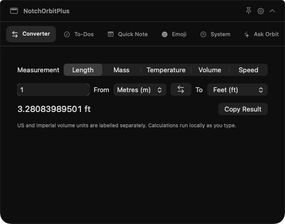
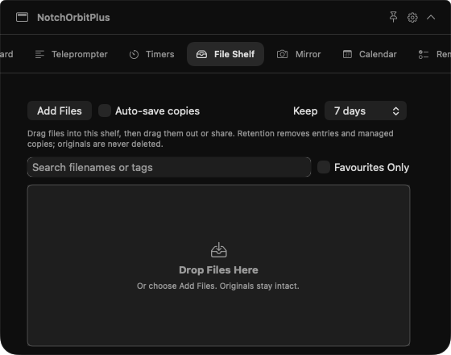
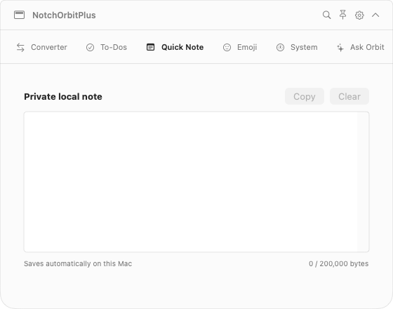

# NotchOrbitPlus

A separate native Mac app copied from NotchOrbit, with an expanded notch dashboard and the original key-free file-action semicircle. Hover or click the compact strip to open tools; pin the dashboard while working. On a Mac without a notch, it uses the display's top center.

The dashboard now has **22 tools**, including Quick Launcher and saved Workflows. It also adds live closed-notch status, meeting controls, shelf organization, clipboard OCR, optional sync and distribution settings. The [OmniNotch reference page](https://omninotch.app/) inspected on October 4, 2026 advertises twenty tools but explicitly names nineteen; this app implements those nineteen named areas under its own Orbit identity, plus NotchOrbit's File Actions and the two new tools. It has its own `com.sknitd.NotchOrbitPlus` bundle identifier, preferences, storage, project and build output. NotchOrbit and OrbitDrop remain separate apps.

## Install and open

[**Download NotchOrbitPlus.app.zip**](https://github.com/sknitd/orbit/raw/fd634cffb5e5cdac27235355dcaef539de6350fb/NotchOrbitPlus.app.zip) · [SHA-256 checksum](https://github.com/sknitd/orbit/blob/fd634cffb5e5cdac27235355dcaef539de6350fb/NotchOrbitPlus.app.zip.sha256)

The universal app targets **macOS 14 or later**, on Apple Silicon and Intel. Developer tools are not needed to run it. If this repository is private, sign in to GitHub with access before downloading.

1. Extract `NotchOrbitPlus.app.zip`, move the entire app to Applications, and open it.
2. Hover or click the compact strip below the notch. **⌘⌃N** toggles the dashboard without observing other typing. Pin it to keep it open.
3. First-run setup lets you choose visible tools, optional drag access, launch at login and automatic update checks. Settings also controls opening behavior, delay, width (560–800 points), display and tab order.
4. Enable Input Monitoring only if you want automatic Finder-drag file actions. Calendar, Reminders, Mirror and Now Playing request their own permissions when you connect or start them.
5. Clipboard history starts only after you enable it. Connected tools provide explicit Refresh/Connect controls and display errors rather than invented data.

The development app is ad hoc signed and **not notarized**. If macOS blocks it, try opening it, then use System Settings → Privacy & Security → Open Anyway if offered. Each Mac needs its own permission grants and integration setup. Developer tools are not required to run the packaged app.

This is version **0.1.0**, built from source `872ea4eab4fbec98d81d622b6100d41cdf5a71ab` by [macOS CI run 37198489083](https://github.com/sknitd/orbit/actions/runs/37198489083). All **115 tests passed**: 37 shared core, 54 NotchOrbitPlus core and 24 hosted native tests, with no failures or skips. Universal Release compilation, strict signature verification and startup checks passed. Native tests rendered all twenty dashboard tools; public weather and foreign-exchange responses were fetched and decoded successfully. See [EVALUATION.md](EVALUATION.md) for evidence and remaining Mac/account checks.

ZIP SHA-256:

```text
e478befe9db4cc4bd4d171c3378015c204a4c62acd19366945a96e6f9fb05e4a
```

## Tools and requirements

| Tool | What it does | Setup or practical limit |
| --- | --- | --- |
| Ask Orbit | On-device chat, rewrite and summarize using Apple Foundation Models | **macOS 26+**, compatible Apple Silicon, enabled Apple Intelligence and downloaded model; no cloud fallback |
| AI Usage | Live Codex quota through a selected installed Codex CLI; imported session/weekly reports for Claude, Codex, Cursor, Copilot and Grok | Live read uses Codex's documented account-only protocol; other providers use imported snapshots, with actual timestamps/limits |
| Sales | Read-only adapters for Stripe, Shopify, Lemon Squeezy, Gumroad, Dodo, Polar and Paddle; recent paid orders, grouped-currency amounts and dated USD conversion | User credentials in this app's Keychain; current UTC creation-day gross paid amounts, available order-attached refunds and ten-page cap are labeled; real-account verification required |
| Clipboard | Search/filter retained clips; recognize, search and copy text inside images with local Vision OCR | History is opt-in; choose Recognize Text on an image, then Copy Text; confidential/transient markers are skipped, which cannot identify every secret |
| Teleprompter | Auto-saved script with import, play/pause, restart, speed and text-size controls | Keep the dashboard open/pinned while reading |
| Timers | Focus/break countdowns, pause/resume, completed sessions, optional automatic breaks and soft focus sound | Deadline survives hiding/sleep; remaining time appears in the closed dashboard |
| File Shelf | Drop/reveal/drag/share, native AirDrop, tags, favourites, filename/tag search and Quick Look | Tags stay in the shelf; retention removes managed copies, never original sources; Quick Look previews the actual selected file |
| Mirror | Live camera preview | Explicit Start and camera consent; video only; stops when hidden |
| Calendar | Real events, next-meeting countdown and one-click Join from supported event links | Explicit Calendar consent; enable closed-notch meeting status; canceled, ended and all-day events do not appear as upcoming meetings |
| Reminders | View and complete real Apple Reminders | Explicit full-access Reminders consent |
| To-Dos | Persistent local tasks, completion and stars | Independent of Apple Reminders |
| Weather | City search, current conditions and seven-day forecast | Open-Meteo network connection; user-chosen city, no location permission |
| Stocks | Quotes and intraday charts for selected tickers | User-provided Alpha Vantage key; provider plan, rate limits and data delay apply |
| Emoji | Search/filter/copy/drag **3,944 fully qualified Unicode 17 emoji** | Versioned official Unicode catalog, with license and provenance; native character palette also available |
| Converter | Live length, mass, temperature, volume and speed conversion | Works locally, including temperature offsets and absolute-zero validation |
| System | Real CPU, memory, disk, network and battery statistics | Samples while visible; desktop Macs may have no battery |
| Quick Note | Auto-saved local note | Oversized/unreadable existing notes are preserved; replacement creates a backup |
| Now Playing | Music/Spotify metadata, artwork, controls, local LRC lyrics and optional closed-notch status | Explicit Connect and Automation consent; enable background monitoring to continue after hiding; reconnect each session |
| Shortcuts | List and run installed macOS Shortcuts | Explicit chosen shortcut; macOS may request the shortcut's own permissions |
| Quick Launcher | Pin, search, rename and reorder apps, folders and favourite Shortcuts | Choose local targets or explicitly refresh installed Shortcuts; launch only on click; missing pins remain editable |
| Workflows | Saved one-drop resize → convert → compress → ZIP presets with progress and cancellation | Choose a preset, drag toward the notch with Workflows selected, then drop on its target; the image pipeline preserves originals and rolls back incomplete output |
| File Actions | Original NotchOrbit contextual image/PDF/media/archive/text transformations | Drag a local file toward the notch without keys; a real drop on a labeled action authorizes processing |

The feature comparison describes implemented tools and their setup, not verified access to a user's camera, calendars, merchant accounts or AI subscription. Interactive and connected-account acceptance is recorded separately in [EVALUATION.md](EVALUATION.md).

## Data and privacy

Notes, tasks, retained clipboard, shelf data, teleprompter scripts and imported usage reports use this app's local storage. Clipboard is opt-in; image OCR runs locally on request. Managed shelf copies can be removed by the selected retention rule; originals are preserved. Camera capture and system sampling stop when hidden. Music background monitoring and closed-notch meeting status have their own opt-in controls.

## Using the additions

The closed notch prioritizes processing progress, then imminent/ongoing meetings, focus timers and music. Smaller icons show concurrent activities. Click or hover to open the relevant visible tool. Connect Music or Spotify in Now Playing and enable background monitoring; connect Calendar and enable closed-notch meetings to show events within 15 minutes of starting. Calendar's Join button opens a recognized conferencing link from the event URL, location or notes.

In **Quick Launcher**, add an app or folder, or refresh Shortcuts and pin a favourite. In **Workflows**, create or select a preset, set its resize, conversion, quality and ZIP stages, and drop files on the native target. Selecting Workflows before dragging reveals its drop target directly without a key press. Outputs use unique names alongside the source, or Downloads when configured; originals stay intact. One ZIP contains the entire batch.

In **File Shelf**, search names/tags, filter favourites, edit comma-separated tags and use Quick Look. In **Clipboard**, enable history, copy an image, choose Recognize Text, then search its recognized text or click Copy Text. Removing a clip cancels its pending recognition.

**Settings → Sync** lets you choose the same iCloud Drive, Dropbox or network folder on each Mac and enable sharing. It syncs Quick Note, To-Dos, tool order/visibility and hover/click preferences. Each device keeps its own snapshot; concurrent edits remain available for explicit resolution and deleted tasks stay deleted. Sync is off by default. Clipboard, shelf files, launcher bookmarks, display settings and integration credentials stay local. Folder contents are readable to whoever can access that folder; delivery depends on your folder provider.

**Settings → Updates** provides launch-at-login, automatic checks every six hours, checksum-verified automatic downloads and trusted automatic installation. All update automation starts off. The current development build supports checking/downloading and manual installation; automatic replacement requires a Developer ID signed running app and a notarized update signed by the same team. The public [stable update feed](https://raw.githubusercontent.com/sknitd/orbit/codex/notch-plus-updates/stable.json) is published only after a successful macOS build.

Weather, stocks, merchant integrations and foreign-exchange lookup contact their respective providers when you request data. Provider credentials are stored in this app's macOS Keychain namespace, not in preferences or source. Use keys with read-only permissions where the provider supports them. There is no telemetry or remote AI fallback. AI Usage does not inspect sign-in caches or extract credentials: its explicit live Codex read lets your selected, already signed-in CLI handle its own authentication. It performs no model, thread, turn or tool call and records only reported quota windows.

## Build

On a Mac with **Xcode 26 or later**, CMake, Python 3 and Git:

```bash
bash NotchOrbitPlus/Scripts/build.sh
open NotchOrbitPlus/build/DerivedData/Build/Products/Release/NotchOrbitPlus.app
```

The app keeps a macOS 14 minimum while weak-linking FoundationModels for eligible macOS 26 systems. Building with an older SDK is rejected so the AI feature is not silently omitted. The script runs portable/native tests, builds both architectures, verifies signing and startup, and writes `NotchOrbitPlus/dist/NotchOrbitPlus.app.zip` and its SHA-256 checksum. It uses an ad hoc signature when no Developer ID identity is configured; notarization is never inferred from a successful development build.

### Developer ID and notarization

The pipeline supports hardened runtime signing, Apple notarization, stapling and Gatekeeper assessment. Actual notarization needs your Apple Developer certificate and App Store Connect notarization credentials. Configure values securely in **GitHub repository Settings → Secrets and variables → Actions**; do not place them in source or chat.

| GitHub Actions secret | Purpose |
| --- | --- |
| `NOTCHORBITPLUS_DEVELOPER_ID_P12_BASE64` | Base64-encoded Developer ID Application certificate and private key exported as `.p12` |
| `NOTCHORBITPLUS_DEVELOPER_ID_P12_PASSWORD` | Password protecting that export |
| `NOTCHORBITPLUS_SIGNING_IDENTITY` | Optional certificate name or hash; a sole Developer ID identity is detected automatically |
| `NOTCHORBITPLUS_NOTARY_KEY_BASE64` | Base64-encoded notarization `.p8` API key |
| `NOTCHORBITPLUS_NOTARY_KEY_ID` | That key's identifier |
| `NOTCHORBITPLUS_NOTARY_ISSUER_ID` | Its issuer identifier |

After configuring credentials, update the version/build numbers in `Resources/Info.plist`, commit that change, and run the NotchOrbitPlus workflow on the current source branch. A new version lets installed apps detect the signed release and keeps existing package URLs immutable. The temporary signing keychain is removed after the job. Local Mac builds can use an existing Keychain identity through `NOTCHORBITPLUS_SIGNING_IDENTITY` and an existing `notarytool` profile through `NOTCHORBITPLUS_NOTARY_PROFILE`.

The published feed records version, source commit, archive size/SHA-256 and actual signing/notarization results. The updater rejects redirects and incorrect size/checksums. Installation verifies the running application's Apple trust, candidate bundle/version, all architecture signatures and the same signing team; automatic installation additionally requires successful notarized-app assessment. It keeps a recovery copy when replacing an installed app. Ad hoc builds require manual installation.

Portable tests on the cloud Linux environment:

```bash
bash NotchOrbitPlus/Scripts/cloud-core-tests.sh
```

The independent workflow `.github/workflows/notchorbitplus.yml` uses a real macOS 26/Xcode 26 runner and publishes status, logs, previews and successful app packages on `codex/notch-plus-builds/run-<id>-<attempt>` branches for Git-only retrieval.

## Native previews

These are captures of the actual native panels from the verified build. They show the dashboard's converter, file shelf and note editor, followed by the inherited file-action semicircle. Interactive Finder dragging and physical-notch placement still need Mac acceptance.








