# NotchOrbitPlus

A separate native Mac app with a notch dashboard and the original key-free file-action semicircle. Hover or click the compact strip to open tools; pin the dashboard while working. Macs without a notch use the display's top center.

Version **0.3.0** has **31 dashboard tools**. Its nine new entries are Screenshot Shelf, Color Picker, Volume & Brightness, Devices, Status, Network, World Clock, GitHub Actions and Focus Stats. Converter also gains currency conversion; Now Playing gains an explicit System source and lyrics lookup; Workflows gains actual video compression. The app retains its own `com.sknitd.NotchOrbitPlus` identity, preferences and storage. NotchOrbit and OrbitDrop remain separate apps.

The [OmniNotch reference page](https://omninotch.app/) inspected on October 4, 2026 advertises twenty tools and explicitly names nineteen. This app implements those nineteen named areas under the Orbit identity, inherited File Actions, Quick Launcher, Workflows and the nine new entries. See [implemented-features.md](implemented-features.md) and [known-limitations.md](known-limitations.md) for source scope and practical limits.

## Install and open

[**Download NotchOrbitPlus.app.zip**](https://github.com/sknitd/orbit/raw/497ffa0672eadf61168e0974c99416086b0b2121/NotchOrbitPlus.app.zip) · [SHA-256 checksum](https://github.com/sknitd/orbit/blob/497ffa0672eadf61168e0974c99416086b0b2121/NotchOrbitPlus.app.zip.sha256)

**Verified macOS build:** 289 tests passed, a universal Release app was built, strict ad hoc signature verification and startup passed, and the ZIP/checksum were independently checked. The package is **not notarized**; hardware, permissions and connected accounts still need acceptance on your Mac.

The universal app targets **macOS 14 or later**, on Apple Silicon and Intel. Developer tools are not needed to run the packaged app. If this repository is private, sign in to GitHub with access before downloading.

1. Extract `NotchOrbitPlus.app.zip`, move the entire app to Applications, and open it.
2. Hover or click the compact strip below the notch. **⌘⌃N** toggles the dashboard without observing other typing. Pin it to keep it open.
3. First-run setup lets you choose visible tools, optional drag access, launch at login and automatic update checks. Settings controls opening behavior, delay, tool order, per-display placement/width, appearance and compact-status priorities.
4. Enable Input Monitoring if you want automatic Finder-drag file actions. Connected tools request their own access only when you choose Connect, Enable, Pick or Start.
5. Clipboard history, background monitoring, HUD interception, lyrics lookup, sync and update automation have explicit opt-in controls. Unavailable data and API failures remain visible.

Development packages are ad hoc signed and **not notarized** unless the configured Apple signing pipeline produces a trusted release. If macOS blocks an ad hoc app, try opening it, then use System Settings → Privacy & Security → Open Anyway if offered. Each Mac needs its own permission grants and integration setup.

The verified 0.3 evidence records source `7dc43a6aec2a4d14657d41186c193b850dcfa43e`, [macOS CI run 37220531371](https://github.com/sknitd/orbit/actions/runs/37220531371), artifact commit `497ffa0672eadf61168e0974c99416086b0b2121`, **123 hosted native tests**, **289 total tests** and **54 native previews**. ZIP size: **8,414,997 bytes**. See [EVALUATION.md](EVALUATION.md) for executed checks and remaining physical-Mac acceptance.

ZIP SHA-256:

```text
f258c6fa17c303a088759cd87e6aa12035e451151aabb6cc7afef30c8f3b89fa
```

## Tools and requirements

| Tool | What it does | Setup or practical limit |
| --- | --- | --- |
| Assistant / Ask Orbit | On-device chat, rewrite and summarize using Apple Foundation Models | **macOS 26+**, compatible Apple Silicon, enabled Apple Intelligence and downloaded model; no cloud fallback |
| AI Usage | Explicit live Codex quota through a selected installed Codex CLI; imported reports for Claude, Codex, Cursor, Copilot and Grok | Codex handles its own authentication; imported snapshots show reported limits/timestamps; no universal subscription-quota API is claimed |
| Sales | Read-only Stripe, Shopify, Lemon Squeezy, Gumroad, Dodo, Polar and Paddle adapters; recent paid orders, grouped currencies and dated USD conversion | Credentials in this app's Keychain; UTC creation-day gross paid amounts, available order-attached refunds and ten-page coverage are labeled; real-account acceptance remains |
| Clipboard | Search/filter retained clips and recognize/copy text in images with local Vision OCR | History is opt-in; confidential/transient markers are skipped, but cannot identify every secret |
| Teleprompter | Auto-saved script, import, scrolling, speed and text-size controls | Keep the dashboard open/pinned while reading |
| Timers | Local focus/break countdowns, pause/resume, optional breaks and soft focus sound | Deadlines survive hiding/sleep; completed focus sessions feed Focus Stats |
| File Shelf | Drop/reveal/drag/share, native AirDrop, tags, favourites, search and Quick Look | Managed-copy retention preserves original sources; captures become managed shelf copies |
| Mirror | Live camera preview | Explicit Start and camera consent; video only; stops when hidden |
| Calendar | Real events, next-meeting countdown and Join from supported event links | Explicit Calendar consent; closed-notch meeting status has its own opt-in |
| Reminders | View and complete real Apple Reminders | Explicit full-access Reminders consent |
| To-Dos | Persistent tasks, completion and stars | Optional sync preserves deletion tombstones and concurrent edits |
| Weather | City search, current conditions and seven-day forecast | Open-Meteo connection; user-selected city; no GPS permission |
| Stocks | Quotes and intraday charts for selected tickers | User Alpha Vantage key; provider plan, rate limits and data delay apply |
| Emoji | Search/filter/copy/drag **3,944 fully qualified Unicode 17 emoji** | Versioned official catalog with license/provenance; native character palette also available |
| Converter | Length, mass, temperature, volume, speed and currency conversion | Physical units work locally; currency uses explicit Refresh and dated Frankfurter rates, with clear missing-rate errors and a dated rate label |
| System | Real CPU, memory, disk, network and battery statistics | Samples while visible; available hardware determines reported values |
| Quick Note | Auto-saved note with optional sync | Oversized/unreadable originals are preserved; explicit replacement keeps a backup |
| Now Playing | Music/Spotify or explicit System metadata, artwork, supported controls, local LRC and opt-in LRCLIB lyrics | Automation applies to Music/Spotify; System uses private MediaRemote and may be restricted; lookup sends track metadata only after opt-in plus a click |
| Shortcuts | List and run installed macOS Shortcuts | Explicit chosen shortcut; its own actions may request permissions |
| Quick Launcher | Search, rename and reorder pinned apps, folders and favourite Shortcuts | Launch is explicit; synced apps use bundle IDs, folders need local resolution and Shortcuts must exist on each Mac |
| Workflows | Saved image resize → convert → compress → ZIP, or actual video compression with optional ZIP | Native drop or explicit run; preserves originals, validates smaller compressed outputs and rolls back failures; image/video stages cannot be mixed |
| Screenshot Shelf | ScreenCaptureKit area/window/display PNGs and short silent MOV recordings into File Shelf | Explicit Start and Screen Recording consent; recordings are 1–60 seconds; hiding/canceling ends capture and removes incomplete output |
| Color Picker | Screen sampling, HEX/RGB/HSL/SwiftUI/NSColor copy formats, history and named palettes | NSColorSampler starts only on Pick; saved palettes can sync; sampling history stays local |
| Volume & Brightness | Optional media-key interception with volume/mute/brightness HUD | Explicit Enable and Accessibility consent; unsupported devices/displays or keys pass through to macOS |
| Devices | Available Mac/HID battery information and explicit paired Bluetooth metadata | Missing battery values remain unavailable; background monitoring is optional |
| Status | Available microphone/input and camera activity, plus authorized Apple Focus shared state | Does not start capture; Focus requires explicit Connect and reports the public shared boolean, without identifying a mode |
| Network | Local interface details, traffic deltas and VPN/tunnel indicators | No external connectivity probe; a tunnel indicator is not a VPN security assessment |
| World Clock | Saved IANA zones, daylight-saving-aware conversion and actual Calendar meeting comparisons | Up to twelve zones; Calendar data uses existing authorized access; zone preferences can sync |
| GitHub Actions | Repository/workflow-run browsing through read-only GitHub.com APIs | Explicit Connect/Refresh; app-specific Keychain token, repository access, rate limits and bounded pagination |
| Focus Stats | Weekly completed focus-session chart and recent history | Local dated completions exclude pauses, canceled sessions and breaks; legacy counts do not invent history |
| File Actions | Original contextual image/PDF/media/archive/text transformations | Drag a local file toward the notch without keys; a real drop on a labeled action authorizes processing |

The table describes implemented behavior and setup. Native fixture tests, public HTTP probes, connected-account acceptance and physical hardware checks are recorded separately in [EVALUATION.md](EVALUATION.md).

## Using the additions

**Now Playing:** choose Music, Spotify or System and Connect explicitly. System uses MediaRemote; unavailable symbols, restricted access or missing metadata are reported, with Music/Spotify available as alternatives. Background monitoring is a separate opt-in. Local `.lrc` import works offline. For online lyrics, enable LRCLIB lookup, then click Lookup; the request sends title/artist/album/duration when available. Track changes cancel an existing lookup and do not issue a new request. Spotify artwork may load from the player's image URL after connection.

**Screenshot Shelf:** choose an area, window or display and start a screenshot or a short silent recording. Captures are validated and copied into managed File Shelf storage even when ordinary shelf Auto-save is off. Stop and Save finishes a recording; Cancel or hiding the capture tool stops it and cleans partial output. Sending a saved capture to a workflow requires a separate explicit action.

**Workflows:** create/select an image or video preset and drop files on its native target. Selecting Workflows before dragging reveals that target without a key press. Image presets offer resize, format, quality and one batch ZIP. Video presets use real H.264 MP4 compression, optionally followed by ZIP; failure to produce a smaller valid video rolls the run back. Outputs use unique names beside the source or in configured Downloads, preserving originals. Shortcuts' Run Workflow action waits for completion and returns durable output files; memory-backed input publishes to Downloads before its temporary input is removed.

**Quick Launcher, File Shelf and Clipboard:** pin local targets or explicitly load installed Shortcuts; launch only on click. Shelf search, tags, favourites and Quick Look operate on the selected file. Clipboard capture is opt-in; choose Recognize Text on an image before searching/copying its locally recognized text.

**Planning and services:** currency requires an explicit refresh and displays the provider's actual rate date. World Clock converts the same instant across saved zones and can use authorized Calendar meetings. Focus Stats charts recorded completions from Timers. Start Focus starts the app's local timer; Status separately reads the authorized Apple Focus shared boolean. GitHub Actions reads repositories and runs only after Connect/Refresh with your own token.

## Settings, keyboard and sync

The compact notch's default order is processing, HUD, meetings, focus timer, music, devices and status. Secondary indicators retain concurrent activities. **Settings → Live Priority** lets you reorder these kinds. **Appearance** provides System/Light/Dark, accent color and optional successful-drop/workflow sound; sound starts off.

Settings provides per-display enabled/width choices, All Spaces/Current Space placement and opt-in fullscreen hiding. Fullscreen detection uses separately granted Accessibility access and keeps unknown windows/displays visible. Display geometry, permission state and shortcut configuration remain local.

**⌘⌃N** toggles the dashboard. Tab moves through native controls; arrow keys navigate the tab strip; Control-Tab/Control-Shift-Tab switch tools; Escape collapses the dashboard. VoiceOver labels and Reduce Motion support are implemented, with interactive assistive-technology acceptance still required.

**Settings → Sync** selects the same iCloud Drive, Dropbox or network folder on each Mac and enables sharing. Sync starts off. It shares Quick Note, To-Dos, logical launcher pins, workflow presets, saved palettes, tool order/visibility, hover/click preferences, appearance, live priorities and World Clock zones. Clipboard, shelf files, credentials, pick history, meeting data, absolute file paths and security bookmarks stay local.

Each Mac writes its own coordinated versioned snapshot. Task deletions retain tombstones. Different library categories merge independently; concurrent changes within a launcher/workflow/palette category retain whole variants until you choose, with a private backup before resolution. Editors and unsaved notes are protected before incoming apply. Apps resolve by bundle ID; synced folder pins require an explicit local folder choice. **All syncing Macs need 0.3.0:** it imports version-1 snapshots and writes version 2, which 0.2.0 rejects safely. Folder JSON is readable to whoever can access the folder; a successful write confirms this Mac's local write, while cross-Mac delivery belongs to your folder provider.

**Settings → Updates** provides launch-at-login, automatic checks every six hours, checksum-verified downloads and trusted installation. All update automation starts off. Ad hoc builds support verified downloads and manual installation; automatic replacement requires a Developer ID signed running app and a notarized update from the same team. The public [stable feed](https://raw.githubusercontent.com/sknitd/orbit/codex/notch-plus-updates/stable.json) is published only after a successful macOS build.

## Shortcuts actions

The installed app exposes **Start Focus**, **Add File to Shelf**, **Run Workflow**, **Toggle Dashboard** and **Capture Screenshot** through AppIntents. Actions bring the app to the foreground. File inputs must be bounded regular files (at most 100 MB). Run Workflow selects a real saved preset, forwards errors/cancellation and returns output files for the next action. Capture Screenshot requests Screen Recording access only when explicitly run. Discovery, user permissions and actual Shortcuts execution still require acceptance on the installed Mac.

## Data and privacy

Notes, tasks, clipboard history, shelf data, scripts, imported usage, focus completions and capture records use this app's local storage. OCR runs locally on request. Visible native tools stop sampling/capture when hidden, with separate opt-ins for supported background status/music/device monitoring. Managed-copy removal preserves source originals.

Weather, FX/currency, stocks, GitHub Actions, merchant integrations and LRCLIB contact their providers when requested. Spotify artwork uses the connected player's image URL. Credentials stay in this app's macOS Keychain namespace; use read-only provider permissions where supported. There is no telemetry or remote AI fallback. AI Usage does not inspect sign-in caches or extract tokens: an explicit live Codex read delegates authentication to your chosen, already signed-in CLI and reads only documented quota windows, without model/thread/turn/tool calls.

## Build

On a Mac with **Xcode 26 or later**, CMake, Python 3 and Git:

```bash
bash NotchOrbitPlus/Scripts/build.sh
open NotchOrbitPlus/build/DerivedData/Build/Products/Release/NotchOrbitPlus.app
```

The app keeps a macOS 14 minimum while weak-linking FoundationModels for eligible macOS 26 systems. Building with an older SDK is rejected so the AI feature is not silently omitted. The script runs portable/native tests, builds both architectures, verifies signing and startup, and writes `NotchOrbitPlus/dist/NotchOrbitPlus.app.zip` and its SHA-256 checksum. It uses an ad hoc signature when no Developer ID identity is configured; notarization is never inferred from a successful development build.

### Developer ID and notarization

The pipeline supports hardened runtime signing, Apple notarization, stapling and Gatekeeper assessment. Actual notarization needs your Apple Developer certificate and App Store Connect notarization credentials. Configure values securely in **GitHub repository Settings → Secrets and variables → Actions**; do not place them in source or chat.

| GitHub Actions secret | Purpose |
| --- | --- |
| `NOTCHORBITPLUS_DEVELOPER_ID_P12_BASE64` | Base64-encoded Developer ID Application certificate and private key exported as `.p12` |
| `NOTCHORBITPLUS_DEVELOPER_ID_P12_PASSWORD` | Password protecting that export |
| `NOTCHORBITPLUS_SIGNING_IDENTITY` | Optional certificate name or hash; a sole Developer ID identity is detected automatically |
| `NOTCHORBITPLUS_NOTARY_KEY_BASE64` | Base64-encoded notarization `.p8` API key |
| `NOTCHORBITPLUS_NOTARY_KEY_ID` | That key's identifier |
| `NOTCHORBITPLUS_NOTARY_ISSUER_ID` | Its issuer identifier |

After configuring credentials, update the version/build numbers in `Resources/Info.plist`, commit that change, and run the NotchOrbitPlus workflow on the current source branch. A new version lets installed apps detect the signed release and keeps existing package URLs immutable. The temporary signing keychain is removed after the job. Local Mac builds can use an existing Keychain identity through `NOTCHORBITPLUS_SIGNING_IDENTITY` and an existing `notarytool` profile through `NOTCHORBITPLUS_NOTARY_PROFILE`.

The published feed records version, source commit, archive size/SHA-256 and actual signing/notarization results. The updater rejects redirects and incorrect size/checksums. Installation verifies the running application's Apple trust, candidate bundle/version, all architecture signatures and the same signing team; automatic installation additionally requires successful notarized-app assessment. It keeps a recovery copy when replacing an installed app. Ad hoc builds require manual installation.

Portable tests on the cloud Linux environment:

```bash
bash NotchOrbitPlus/Scripts/cloud-core-tests.sh
```

The independent workflow `.github/workflows/notchorbitplus.yml` uses a real macOS 26/Xcode 26 runner and publishes status, logs, previews and successful app packages on `codex/notch-plus-builds/run-<id>-<attempt>` branches for Git-only retrieval.

## Native previews

The evaluator generates captures of actual native views, including all 31 dashboard modules. Additional images use clearly labeled synthetic fixtures for dated rates, session history, media state, HUD and priorities. The completed 0.3 run generated **54 native PNGs**; the files below are copied unchanged from that artifact. Fixtures are identified by their output names and documentation captions. Rendering does not establish physical-notch placement, hardware permissions or connected accounts.

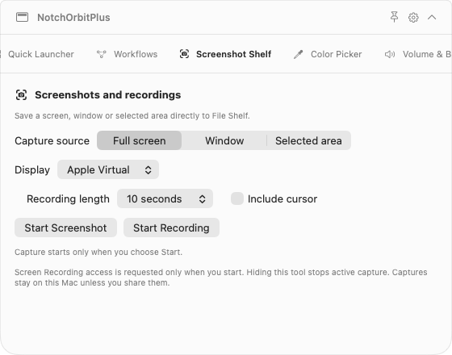

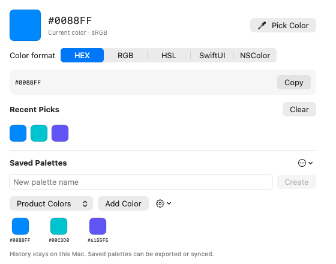

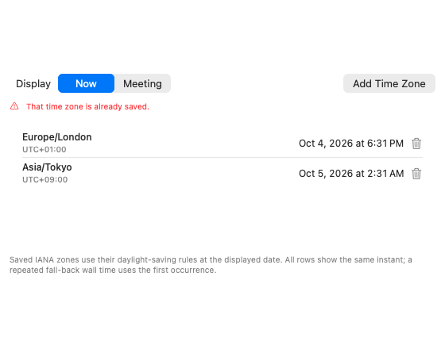

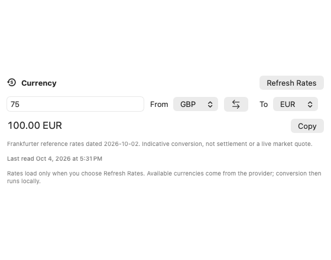

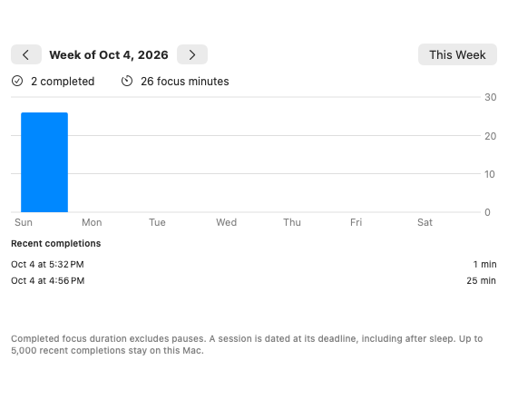

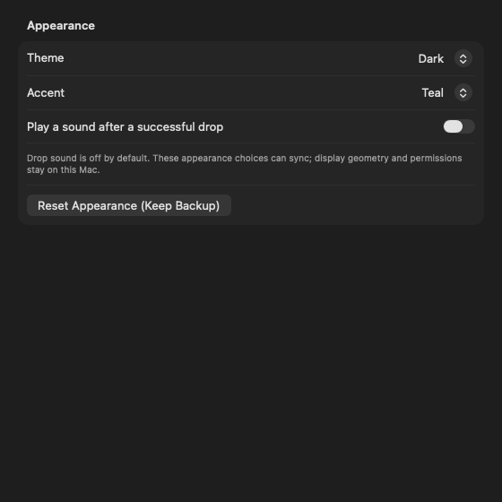

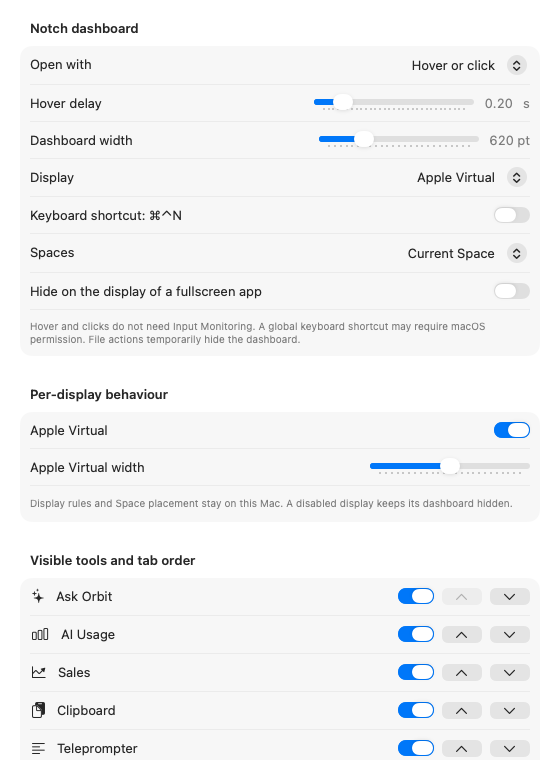

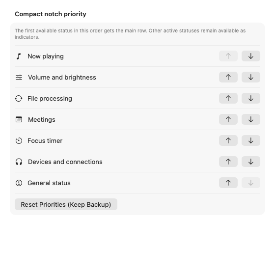

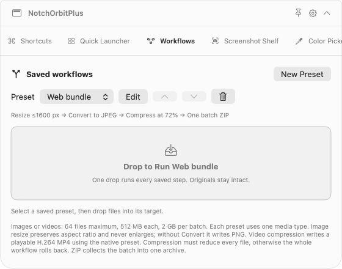

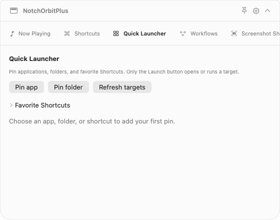

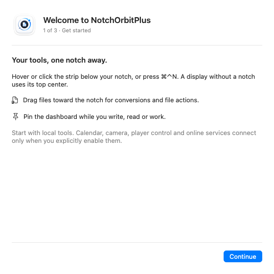


